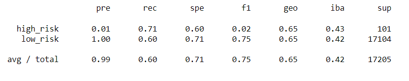
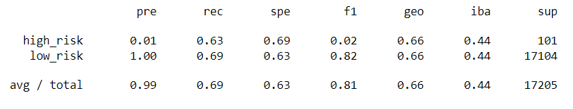
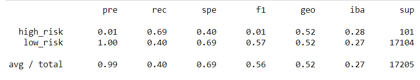
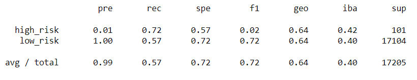
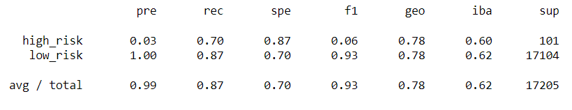
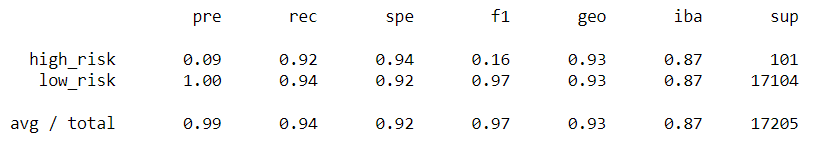

#### Challenge 17: Module 17

# Overview of Project

## Purpose of Credit Risk Analysis

During module 17, the use of different Machine Learning models were used to analyze loans. In the challenge, the analyzed topic is “credit risk”, being an unbalanced classification sample. One of the most important parts of the challenge is to use imbalanced-learn and scikit-learn libraries to resampling the model and evaluate the results. The algorithms used to oversample are RandomOverSampler and SMOTE, and the one for undersample is ClusterCentroids. Also the SMOTEENN algorithm was used for a combinatorial approach of over- and undersampling. At the end of the challenge, two Machine Learning models that reduce bias were compared for credit risk.

# Results

Classification reports made with each Machine Learning model are located in the next section. Six models were used, having six complete tables for each, including their balanced accuracy scores and the precision.

* Naive Random Oversampling

###### Image 1. Imbalanced classification report.

* SMOTE Oversampling

###### Image 2. Imbalanced classification report.

* Undersampling

###### Image 3. Imbalanced classification report.

* Combination (Over and Under) Sampling

###### Image 4. Imbalanced classification report.

* Balanced Random Forest Classifier

###### Image 5. Imbalanced classification report.

* Easy Ensemble AdaBoost Classifier

###### Image 6. Imbalanced classification report.

# Summary
